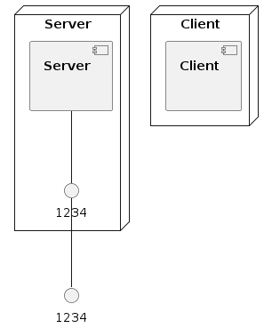

# Client/Server docker-compose example
You need to use ubuntu machine in aws 
and clone this repo .
after that just build and launch. if you see Docker compose is magic it means your app is working

## How to run ?

The project launch is in two parts: build and start.

### Build

```
$ docker-compose build
```

### Launch

```
$ docker-compose up
```


### Infrastructure model

